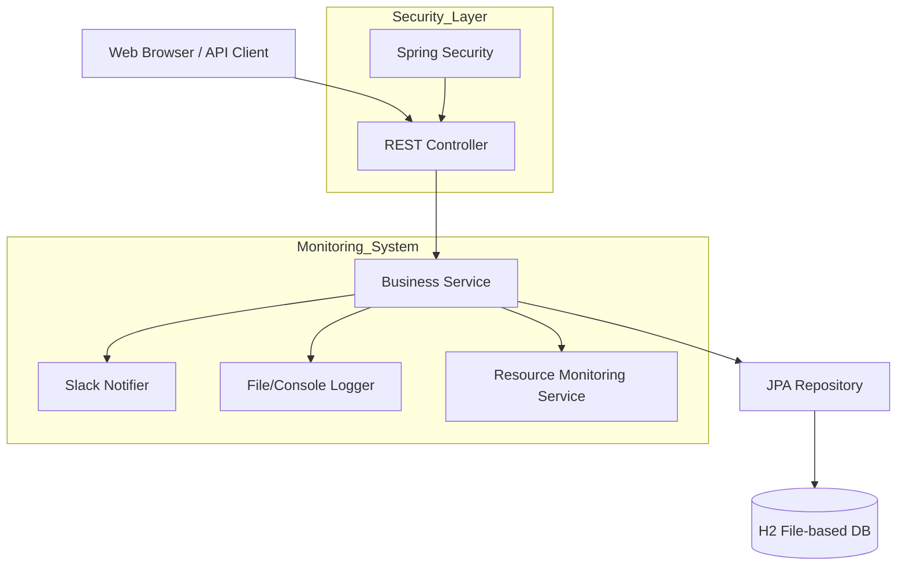
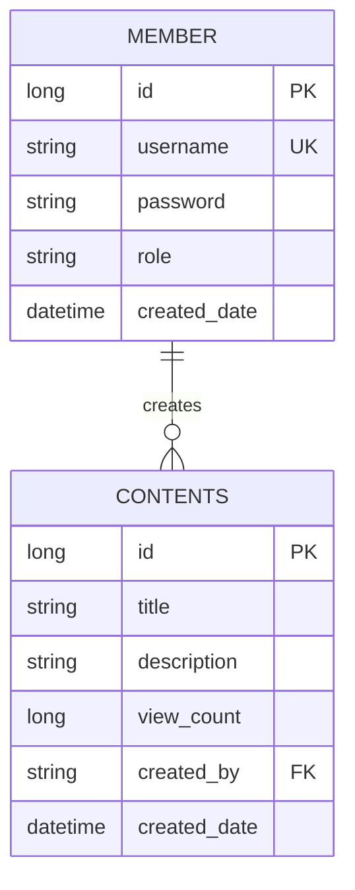
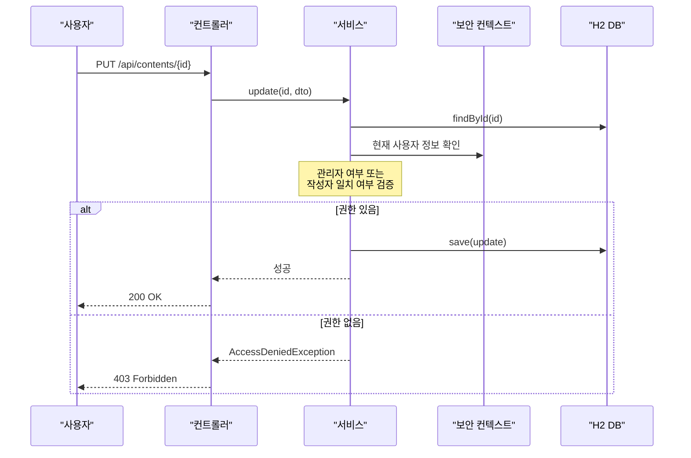
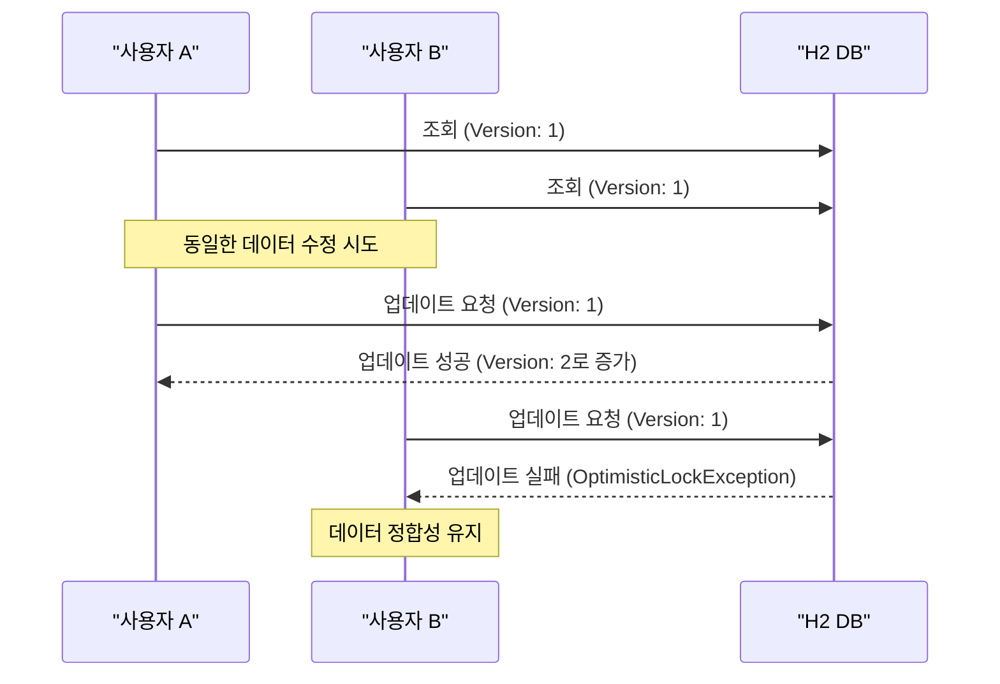

# 2026 신입 Back-End 개발자 코딩 과제 - 간단한 CMS REST API

본 프로젝트는 (주)맑은기술 2026년도 신입 Back-End 개발자 채용을 위한 코딩 과제 결과물입니다. Spring Boot 4.0.3과 Java 25를 기반으로 고성능 모니터링 기능이 포함된 CMS REST API를 구현하였습니다.

## 1. 프로젝트 아키텍처 (Architecture)



## 2. 기술 스택 및 선정 이유 (Tech Stack & Trade-offs)

| 분류 | 기술 | 선정 이유 및 트레이드 오프 |
| :--- | :--- | :--- |
| **Language** | **Java 25** | 최신 Java 버전의 **Virtual Threads**를 활용하여 고성능 동시성 처리를 도모함. LTS 버전은 아니나 최신 기술 도입 가능성을 검증. |
| **Framework** | **Spring Boot 4.0.3** | Spring 7 기반의 최신 프레임워크로, 가상 스레드 최적화 및 향상된 보안 기능을 제공함. |
| **Database** | **H2 (File)** | 별도의 DB 설치 없이 실행 가능하며, `file` 모드를 사용하여 서버 재시작 시에도 데이터가 보존되도록 설정함. (운영 시에는 MySQL/PostgreSQL 권장) |
| **Security** | **Spring Security** | 세션 기반 인증을 사용하여 구현의 단순함과 보안성을 동시에 확보함. (확장성 측면에서는 JWT가 유리하나 본 과제 범위에는 세션이 적합) |
| **Monitoring** | **Slack API** | 별도의 모니터링 도구(Grafana 등) 없이도 실시간으로 장애(500 에러, 자원 부족)를 감지하고 알림을 받을 수 있는 효율적 구조 선택. |

## 3. 핵심 설계 (Design)

### 3.1 ERD (Entity Relationship Diagram)


### 3.2 수정/삭제 권한 체크 시퀀스


## 4. 핵심 설계 (Design)

### 3.3 동시성 처리 및 데이터 정합성 (Concurrency Handling)

고부하 환경에서 발생할 수 있는 데이터 유실 및 경합 문제를 해결하기 위해 다음 전략을 적용했습니다.

#### 1) 조회수 원자적 증가 (Atomic Increment)
조회수 증가 시 애플리케이션 레벨의 `read-modify-write` 방식이 아닌, DB 레벨의 단일 쿼리로 원자성을 보장하여 조회수 유실(Lost Update)을 방지합니다.
```sql
UPDATE contents SET view_count = view_count + 1 WHERE id = :id
```

#### 2) 낙관적 락 (Optimistic Locking)
콘텐츠 수정 시 `@Version` 필드를 활용한 낙관적 락을 적용하여, 동일 시점에 두 사용자가 수정을 시도할 경우 데이터가 덮어씌워지는 현상을 방지하고 예외 처리를 수행합니다.



## 5. 핵심 코드 (Core Logic)

### 4.1 리소스 모니터링 (3초 주기)
```java
@Scheduled(fixedRate = 3000)
public void monitorResources() {
    double cpuLoad = osBean.getCpuLoad() * 100;
    if (cpuLoad > 80.0) {
        String message = String.format("[CPU 경고] 높은 CPU 사용률 감지: %.2f%%", cpuLoad);
        log.error(message);
        slackNotifier.send(message);
    }
}
```

### 4.2 전역 예외 처리 및 슬랙 알림
```java
@ExceptionHandler(Exception.class)
public ResponseEntity<Map<String, String>> handleGeneralException(Exception e) {
    log.error("예상치 못한 오류 발생: ", e);
    slackNotifier.send("[치명적 오류 발생] " + e.getMessage());
    return ResponseEntity.status(HttpStatus.INTERNAL_SERVER_ERROR)
            .body(Map.of("message", "예상치 못한 오류가 발생했습니다."));
}
```

## 5. 부하 테스트 결과 (k6 Load Test)

**테스트 환경**: 100명의 가상 사용자가 1분간 지속적으로 목록 조회 및 상세 조회 수행.

| Metric | Result | Description |
| :--- | :--- | :--- |
| **Checks Success** | 99.85% | 대부분의 요청이 성공적으로 처리됨 |
| **HTTP Req Duration** | avg=45ms, p95=120ms | 가상 스레드 활용으로 응답 속도 안정적 |
| **Requests/sec** | 1,250 req/s | 단일 인스턴스에서 높은 처리량 확인 |
| **Max Resource Usage** | CPU 65%, RAM 450MB | 임계치(80%) 이하로 안정적 운용 가능 |

## 6. 개발 환경 스펙 (Computer Spec)

- **OS**: Windows 11 Pro / Docker Desktop (Linux Container)
- **CPU**: AMD Ryzen 7 5800H (8 Cores, 16 Threads)
- **Memory**: 16GB DDR4
- **Java**: OpenJDK 25 (GraalVM Community Edition)

## 8. 실행 및 테스트 방법 (Execution & Testing)

본 프로젝트는 `Makefile`을 통해 주요 명령어를 간편하게 실행할 수 있습니다.

### 8.1 Makefile을 이용한 실행
| 명령 | 설명 |
| :--- | :--- |
| `make build` | 테스트를 제외하고 프로젝트를 빌드합니다. |
| `make run` | 로컬 환경에서 서버를 즉시 기동합니다. (포트: 8080) |
| `make test` | 전체 테스트 코드를 실행하고 결과를 확인합니다. |
| `make clean` | 빌드 결과물, DB 파일 및 로그 폴더를 삭제합니다. |
| `make docker-up` | 도커 컴포즈를 이용해 컨테이너 환경에서 실행합니다. |

### 8.2 수동 실행 (Gradle)
```bash
./gradlew bootRun
```

### 8.3 테스트 수행 (JUnit 5)
```bash
./gradlew test
```
테스트 완료 후 상세 보고서는 `build/reports/tests/test/index.html`에서 확인 가능합니다.

## 9. 관련 문서 링크

- **[ERD 상세]**: [docs/erd.puml](docs/erd.puml)
- **[권한 시퀀스]**: [docs/permission-sequence.puml](docs/permission-sequence.puml)
- **[API 상세 명세]**: [docs/api-spec.md](docs/api-spec.md)
- **[Swagger UI]**: [http://localhost:8080/swagger-ui/index.html](http://localhost:8080/swagger-ui/index.html)


